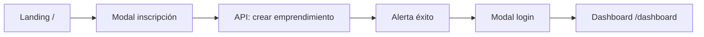

# INGEINNOVA — Documentación del Frontend

Interfaz web de **INGEINNOVA**, plataforma de emprendimiento de la Universidad de Colombia (Unicolombo). Permite inscribir proyectos, iniciar sesión, seguir la ruta de etapas y administrar emprendimientos desde un panel de admin.

El código vive en la carpeta `frontend/`. Este documento describe cómo funciona, qué incluye y cómo está organizado.

---

## Stack tecnológico

| Tecnología | Uso |
|------------|-----|
| **React 19** | UI por componentes |
| **Vite 8** | Bundler y servidor de desarrollo |
| **React Router 7** | Navegación y rutas |
| **Tailwind CSS 4** | Estilos utilitarios |
| **Fetch API** | Comunicación con el backend |

No hay librería de estado global (Redux/Zustand). Se usa estado local de React, `localStorage` para sesión y datos de usuarios registrados.

---

## Cómo ejecutar

### Con Docker (recomendado en el monorepo)

```bash
cd INGEINNOVA
docker compose up frontend
```

Abre: **http://localhost:5173**

### Solo frontend (desarrollo local)

```bash
cd frontend
npm install
npm run dev:pro
```

### Build de producción

```bash
cd frontend
npm run build:pro
npm run preview
```

### API del backend

Por defecto el frontend llama a:

```
http://localhost:8000
```

Configurado en `frontend/app/services/api.js`. El backend debe estar levantado para inscripciones, listados y CRUD.

---

## Arquitectura general

```
index.html
    └── main.jsx          → Monta React y carga estilos
            └── App.jsx     → Router y definición de rutas
                    ├── Landing (pública)
                    ├── Login (redirección)
                    ├── Rutas emprendedor (ProtectedRoute + AppLayout)
                    └── Rutas admin (AdminProtectedRoute + AdminLayout)
```

### Capas

1. **Páginas (`pages/`)** — Pantallas completas por ruta.
2. **Componentes (`components/`)** — UI reutilizable (botones, modales, formularios, layouts).
3. **Servicios (`services/`)** — Llamadas HTTP al backend y lógica de autenticación.
4. **Utilidades (`utils/`)** — Helpers (por ejemplo `propietario_id`).
5. **Hooks (`hooks/`)** — Lógica reutilizable (animaciones al scroll).

---

## Flujos principales

### 1. Visitante → Inscripción → Login → Panel emprendedor



1. En la **landing** (`/`) el usuario ve información del programa y abre el **modal de inscripción**.
2. Completa el **formulario multi-paso** (hasta 4 personas con cédula + datos del emprendimiento).
3. Al enviar, se crea el emprendimiento en el backend y se guardan las cédulas en `localStorage`.
4. Aparece la **alerta de éxito** con instrucciones para iniciar sesión.
5. En el **modal de login** usa su **cédula** como usuario y contraseña.
6. Entra al **panel** (`/dashboard`): perfil del emprendimiento y etapas con progreso.

### 2. Administrador

```mermaid
flowchart LR
  A[Modal login] --> B{admin / admincontraseña?}
  B -->|Sí| C[/admin]
  B -->|No| D[Cédula registrada]
  D --> E[/dashboard]
```

- **Usuario:** `admin`
- **Contraseña:** `admincontraseña`
- Accede a **`/admin`**: listado de todos los emprendimientos, CRUD y seguimiento por proyecto.

---

## Rutas

| Ruta | Acceso | Descripción |
|------|--------|-------------|
| `/` | Público | Landing: info, inscripción y login en modales |
| `/login` | Público | Redirige a `/` y abre el modal de login |
| `/dashboard` | Emprendedor | Panel: perfil + etapas del emprendimiento |
| `/profile` | Emprendedor | Perfil detallado y datos de la ruta |
| `/emprendimiento/:id` | Emprendedor | Detalle, progreso y avanzar etapas |
| `/phases/:id` | Emprendedor | Administración de etapas (vista alternativa) |
| `/admin` | Admin | Tabla de emprendimientos + CRUD |
| `/admin/emprendimiento/:id` | Admin | Seguimiento y avance de etapas de un proyecto |
| `*` | Público | Página 404 |

### Protección de rutas

- **`ProtectedRoute`** — Solo emprendedores autenticados. Si entra un admin, redirige a `/admin`.
- **`AdminProtectedRoute`** — Solo admin. Si entra un emprendedor, redirige a `/dashboard`.
- Sin sesión → redirección a `/` con el modal de login abierto.

---

## Autenticación (`services/authService.js`)

Autenticación **en el cliente** (demo). Pensada para reemplazarse por JWT/sesión del backend más adelante.

### Emprendedor

- Tras inscribirse, cada **cédula** del equipo queda en `localStorage` (`ingeinnova_usuarios`).
- Login: **usuario = cédula**, **contraseña = misma cédula**.
- Sesión en `ingeinnova_session` con rol `emprendedor`, nombre, `emprendimientoId`, `propietarioId`.

### Administrador

- Credenciales fijas: `admin` / `admincontraseña`.
- Sesión con rol `admin`.

### Funciones principales

| Función | Descripción |
|---------|-------------|
| `login(usuario, password)` | Admin o emprendedor según credenciales |
| `logout()` | Cierra sesión |
| `getSession()` | Devuelve la sesión actual |
| `isAuthenticated()` | ¿Hay sesión activa? |
| `isAdmin()` / `isEmprendedor()` | Tipo de usuario |
| `registrarUsuariosDesdeInscripcion()` | Guarda cédulas tras el formulario |

---

## Servicios API (`services/`)

Todos usan el helper `fetcher` de `api.js` (JSON, manejo de errores).

### `EmprendimientoService.js`

| Método | Endpoint | Uso |
|--------|----------|-----|
| `crear` | `POST /emprendimiento/` | Inscripción (crea ruta y 4 etapas en backend) |
| `listar` | `GET /emprendimiento/` | Listado (admin y fallback) |
| `obtener` | `GET /emprendimiento/{id}` | Detalle |
| `actualizar` | `PUT /emprendimiento/{id}` | Edición (admin) |
| `eliminar` | `DELETE /emprendimiento/{id}` | Borrado (admin) |

### `RutaService.js`

| Método | Endpoint | Uso |
|--------|----------|-----|
| `obtenerPorEmprendimiento` | `GET /ruta/{emprendimientoId}` | Ruta del proyecto |
| `avanzar` | `POST /ruta/{rutaId}/avanzar` | Completar etapa actual y pasar a la siguiente |
| `obtenerProgreso` | `GET /ruta/{rutaId}/progreso` | Porcentaje y etapas completadas |

### `EtapaService.js`

| Método | Endpoint | Uso |
|--------|----------|-----|
| `listarPorEmprendimiento` | `GET /etapas/{emprendimientoId}` | Lista de etapas |
| `completar` | `POST /etapas/{etapaId}/completar` | Marcar etapa completada |

---

## Páginas

| Archivo | Rol |
|---------|-----|
| `Landing.jsx` | Página pública, modales de inscripción/login, scroll animado |
| `Login.jsx` | Compatibilidad: redirige a `/` con modal abierto |
| `Dashboard.jsx` | Panel emprendedor: perfil + etapas + avanzar ruta |
| `Profile.jsx` | Perfil y metadatos del emprendimiento |
| `emprendimientoDetail.jsx` | Vista detallada de un emprendimiento |
| `Phases.jsx` | Gestión de etapas por ID |
| `AdminDashboard.jsx` | Tabla admin, crear/editar/eliminar en modales |
| `AdminEmprendimientoDetail.jsx` | Seguimiento admin de un emprendimiento |
| `NotFound.jsx` | 404 |

---

## Componentes destacados

| Componente | Función |
|------------|---------|
| `Formularioemprendimiento.jsx` | Formulario de inscripción en 4 pasos; hasta 4 personas con cédula |
| `LoginFormulario.jsx` | Login emprendedor (cédula) o admin |
| `Modal.jsx` | Ventana flotante con **portal a `document.body`** (overlay a pantalla completa) |
| `SuccessAlert.jsx` | Confirmación post-inscripción |
| `AppLayout.jsx` | Navbar azul + sidebar emprendedor |
| `AdminLayout.jsx` | Navbar gris + sidebar admin |
| `Button.jsx` | Botones Primary, Secondary, Danger, Small con animaciones |
| `Card.jsx` / `Typography.jsx` | Tarjetas y escala tipográfica |
| `ProtectedRoute.jsx` / `AdminProtectedRoute.jsx` | Guards de rutas |

---

## Formulario de inscripción (4 pasos)

1. **Personas** — Hasta 4 integrantes: categoría, nombre, **cédula**, correo, teléfono, barrio, localidad.
2. **Datos académicos** — Según categoría del contacto principal (semestre, programa, jornada).
3. **Emprendimiento** — Nombre, descripción, tipo, sector.
4. **Información adicional** — Empresa constituida, tiempo, familiar, CVLac, RUT, redes.

Al enviar, solo **nombre**, **descripción** y **propietario_id** van al API hoy; el resto queda listo en el objeto del formulario para cuando el backend lo soporte.

---

## Animaciones y UX (`main.css` + hooks)

- **Scroll suave** en toda la página.
- **Reveal al scroll** (`useScrollReveal` + clase `reveal-on-scroll`) en la landing.
- **Botones** con elevación, brillo y press (`btn-interactive`).
- **Modales** con fade del fondo y escala del panel.
- **Sidebar** con deslizamiento y overlay con blur.
- **Tarjetas** con hover (`card-hover`).
- **Barras de progreso** animadas (`progress-bar-animated`).
- Respeto a **`prefers-reduced-motion`** para accesibilidad.

---

## Estructura de archivos

```
frontend/
├── app/
│   ├── App.jsx                 # Router principal
│   ├── main.jsx                # Entry point
│   ├── main.css                # Estilos globales y animaciones
│   ├── components/
│   │   ├── AdminLayout.jsx
│   │   ├── AdminProtectedRoute.jsx
│   │   ├── AdminSidebar.jsx
│   │   ├── AppLayout.jsx
│   │   ├── Button.jsx
│   │   ├── Card.jsx
│   │   ├── Formularioemprendimiento.jsx
│   │   ├── LoginFormulario.jsx
│   │   ├── Modal.jsx
│   │   ├── ProtectedRoute.jsx
│   │   ├── SidebarNavigationDualTierDemo.jsx
│   │   ├── SuccessAlert.jsx
│   │   └── Typography.jsx
│   ├── hooks/
│   │   └── useScrollReveal.js
│   ├── pages/
│   │   ├── AdminDashboard.jsx
│   │   ├── AdminEmprendimientoDetail.jsx
│   │   ├── Dashboard.jsx
│   │   ├── emprendimientoDetail.jsx
│   │   ├── Landing.jsx
│   │   ├── Login.jsx
│   │   ├── NotFound.jsx
│   │   ├── Phases.jsx
│   │   └── Profile.jsx
│   ├── services/
│   │   ├── api.js
│   │   ├── authService.js
│   │   ├── EmprendimientoService.js
│   │   ├── EtapaService.js
│   │   └── RutaService.js
│   └── utils/
│       └── propietario.js      # UUID de propietario en localStorage
├── index.html
├── package.json
├── vite.config.js
├── tailwind.config.js
├── postcss.config.js
├── Dockerfile
└── README.md                   # Guía breve dentro de frontend/
```

---

## Almacenamiento local (`localStorage`)

| Clave | Contenido |
|-------|-----------|
| `ingeinnova_session` | Sesión actual (rol, cédula, emprendimientoId, etc.) |
| `ingeinnova_usuarios` | Cédulas y datos de personas registradas en inscripciones |
| `propietario_id` | UUID del propietario al crear emprendimientos |

---

## Modales y overlay

Los modales usan **`createPortal(..., document.body)`** para que el fondo oscuro cubra **toda la pantalla**, sin quedar recortado por contenedores con `overflow` o `transform` del layout.

Tipos de modal en la app:

- Inscripción (landing)
- Login (landing)
- Éxito post-inscripción
- Crear / editar / eliminar emprendimiento (admin)

---

## Próximos pasos sugeridos (backend)

- Autenticación real (JWT, login en API).
- Persistir en backend todos los campos del formulario (personas, académicos, etc.).
- Filtrar emprendimientos por `propietario_id` en el panel emprendedor.
- Variables de entorno para `VITE_API_URL` en lugar de URL fija en `api.js`.

---

## Equipo

Desarrollo frontend — **Will Sepúlveda** · Proyecto **INGEINNOVA** · Unicolombo.
